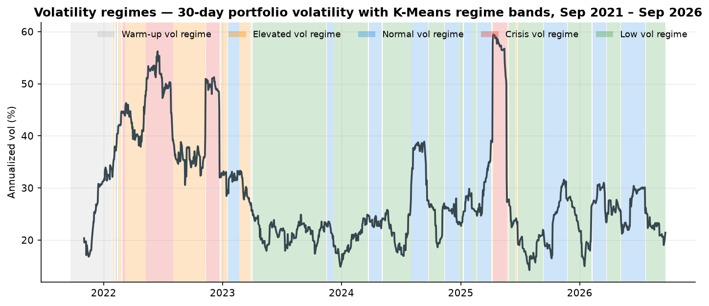
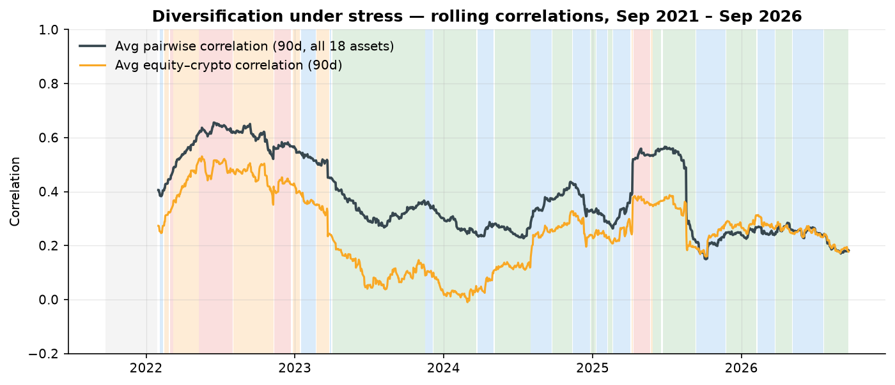
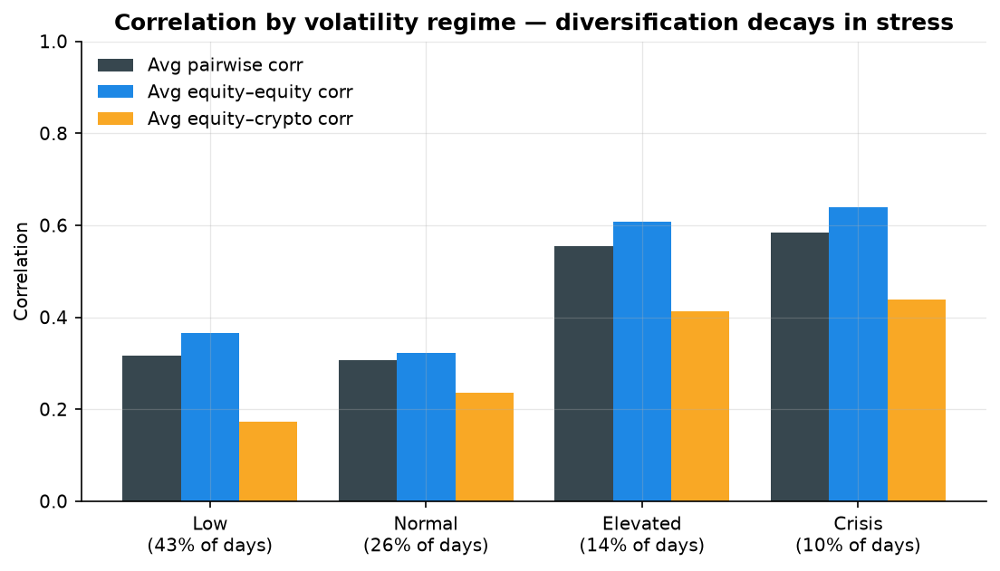
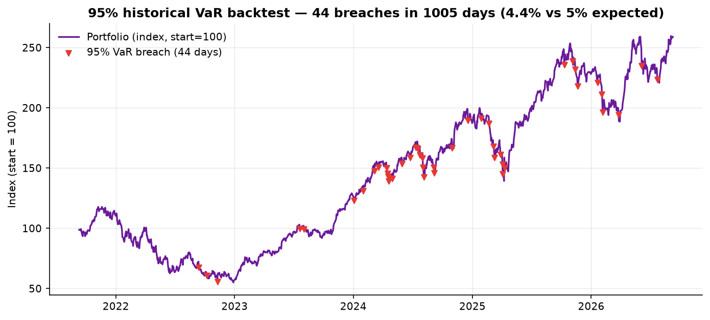

# Portfolio Risk & Regime Dashboard

**A Python + Power BI analytics tool that tracks risk metrics and volatility regimes across an 18-asset tech + crypto portfolio — ending in an analyst-style written recommendation.**

[](https://github.com/EvilSnIzer/quant/actions/workflows/data-pipeline.yml)

The pipeline pulls 5 years of daily prices (Yahoo Finance, no API key) and macro context (FRED), computes a full risk layer — rolling volatility, correlations, historical VaR, drawdowns — clusters market conditions into volatility regimes with K-Means, and exports everything as clean tables that feed a three-page Power BI dashboard. A one-page, auto-templated [risk memo](reports/Portfolio_Risk_Summary.pdf) closes the loop in plain English.

---

## What the data says (Sep 2021 → Sep 2026)

| | |
|---|---|
| **Portfolio** | Equal-weighted: 15 technology-sector mega/large-caps + BTC, ETH, SOL |
| **CAGR / vol** | 21.4% annualized, at 30.3% vol (Sharpe rf=0: 0.78) |
| **Current risk** | 1-day 95% historical VaR **2.6%** (99%: 4.3%), 30-day vol 20.9% |
| **Max drawdown** | **−53.3%** (Nov 2021 peak → Dec 2022 trough, recovered in 344 days) |
| **VaR backtest** | 95% level breached 44 of 1,005 days (**4.4%** vs 5% expected) |
| **Regimes** | Low 42% · Normal 26% · Elevated 15% · Crisis 10% of trading days |
| **Key finding** | Avg pairwise correlation **0.32 → 0.58** (Low → Crisis regime); equity–crypto correlation **0.17 → 0.44**. Diversification broke down exactly when it was needed. |









*(All exhibits regenerate automatically from the pipeline — see `reports/charts/`.)*

## The written output

[`reports/Portfolio_Risk_Summary.pdf`](reports/Portfolio_Risk_Summary.pdf) is a one-page, consulting-style memo. Every number in it is computed and templated by `scripts/07_generate_memo.py` — nothing is hand-typed, so the memo can never drift from the data. It carries four data-backed findings and four recommendations (position sizing off crisis-regime vol, stress-testing at crisis correlations, VaR process upgrades, operationalizing the regime flag).

## Architecture

```
                    ┌────────────────────────────────────────────────────────┐
                    │                 GitHub Actions (data-pipeline.yml)      │
                    │  runs the whole pipeline on a scheduler/trigger and    │
                    │  commits refreshed data + reports back to the repo     │
                    └────────────────────────────────────────────────────────┘
                                             │
  Yahoo Finance ──► 01_fetch_data.py ──► data/raw/            (prices, macro)
  FRED (keyless) ──►        │
                           ▼
                    02_build_returns.py ──► data/processed/    (aligned returns
                           │                                    table, EW portfolio)
                           ▼
                    03_risk_metrics.py ──► rolling vol · correlation matrices ·
                           │              historical VaR + breaches · drawdowns
                           ▼
                    04_regimes.py ──────► K-Means regime labels + episodes
                           │
                           ▼
                    05_export_powerbi.py ► data/processed/powerbi/  (star-schema CSVs)
                           │
              ┌────────────┴────────────┐
              ▼                         ▼
   06_make_charts.py           Power BI Desktop
   (reports/charts/*.png)      (powerbi/BUILD_GUIDE.md
              │                 + measures.dax)
              ▼
   07_generate_memo.py ──► reports/Portfolio_Risk_Summary.pdf
```

## Data sources

| Source | What | Access |
|---|---|---|
| Yahoo Finance (`yfinance`) | Daily adjusted closes: AAPL, MSFT, NVDA, GOOGL, AMZN, META, TSLA, AMD, NFLX, CRM, ORCL, ADBE, AVGO, QCOM, INTC, BTC-USD, ETH-USD, SOL-USD + SPY/QQQ benchmarks | free, no API key |
| FRED | 10-Year Treasury yield (DGS10), CBOE VIX (VIXCLS), broad trade-weighted dollar index (DTWEXBGS) | free public CSV endpoint, no API key |

Provenance for the current snapshot (fetch time, library versions, row counts) is committed at `data/raw/_fetch_manifest.json`.

## Methodology

- **Returns** — daily simple returns on split/dividend-adjusted closes. The portfolio is **equal-weighted, daily-rebalanced** (each day's return = mean of available asset returns).
- **Calendar** — everything is evaluated on the US equity trading calendar (~252 days/yr); crypto is sampled on those dates, so a Friday→Monday crypto move books on Monday. Vol is annualized with √252 uniformly.
- **Rolling volatility** — 30-day and 90-day rolling std of daily returns, annualized.
- **Correlations** — full-sample matrix, 90-day rolling average pairwise correlation, per-regime matrices, and block averages (equity–equity, equity–crypto).
- **Historical VaR (95%, 99%)** — non-parametric percentile method: the 5th/1st percentile of the trailing 250 daily returns, reported as a positive loss magnitude. A *breach* is a daily return strictly below −VaR. No parametric or Monte Carlo methods.
- **Drawdown** — price / running max − 1, per asset and for the portfolio; max drawdown with peak/trough/recovery dates.
- **Volatility regimes** — K-Means (k=4, fixed seed, n_init=10) on five standardized daily features: cross-asset average 30-day vol, cross-asset vol dispersion, 90-day average pairwise correlation, portfolio 30-day vol, and VIX. Clusters are ordered by volatility into **Low / Normal / Elevated / Crisis**; labels are smoothed with a 5-day majority filter for episode reporting. A degenerate-cluster guard refits with k−1 if any cluster holds <4% of days.
- **Sharpe ratio** — excess return to volatility with rf = 0 (a ranking metric here, not a performance fee narrative).

## Limitations (read before quoting numbers)

- **Historical VaR assumes the recent past is representative** of the near future. It is a percentile of history, not a full risk model — no fat-tail modeling, no scenario augmentation.
- **Correlations and volatilities are estimates** that cluster and shift around regime transitions; the 250-day VaR window adapts slowly by design.
- **K-Means is descriptive, not predictive**: features are z-scored on the full sample (mild lookahead) and the labels explain past structure rather than forecast transitions.
- **Crypto on the equity calendar** — weekend crypto moves book to Monday (variance preserved, daily path compressed).
- **Equal-weight daily rebalancing** ignores transaction costs, slippage and taxes.
- Data comes from free endpoints; no audit or corporate-actions reconciliation beyond Yahoo's adjusted closes.

## Quickstart

```bash
git clone https://github.com/EvilSnIzer/quant.git
cd quant
pip install -r requirements.txt

python scripts/01_fetch_data.py      # Yahoo + FRED  → data/raw/
python scripts/02_build_returns.py   # aligned returns + EW portfolio
python scripts/03_risk_metrics.py    # vol, corr, VaR, drawdown
python scripts/04_regimes.py         # K-Means regime labels
python scripts/05_export_powerbi.py  # Power BI tables
python scripts/06_make_charts.py     # PNG exhibits
python scripts/07_generate_memo.py   # one-page PDF memo
```

Change the portfolio by editing `config/portfolio.toml` (tickers, windows,
cluster count) — every downstream step is config-driven.

**Power BI:** open Power BI Desktop, import the CSVs from
`data/processed/powerbi/`, then follow [`powerbi/BUILD_GUIDE.md`](powerbi/BUILD_GUIDE.md)
and create the measures from [`powerbi/measures.dax`](powerbi/measures.dax).
The report: **Page 1** portfolio overview (cumulative returns, current VaR,
drawdown), **Page 2** correlation heatmap with a regime filter, **Page 3**
regime timeline with regime-duration stats.

## Data refresh

`.github/workflows/data-pipeline.yml` runs the full pipeline on GitHub-hosted
runners and commits refreshed outputs. It triggers on pipeline-code changes and
on a weekly schedule (note: `schedule` only fires from the default branch —
merge to `main` to activate it), and can be run manually from the Actions tab
once merged. Because the runner has unrestricted internet access, the free
Yahoo/FRED endpoints work there even from environments where they are blocked.

## Repository layout

```
config/portfolio.toml        # universe, windows, clustering parameters
scripts/01..07_*.py          # pipeline steps (see Architecture)
data/raw/                    # fetched prices + macro + provenance manifest
data/processed/              # analytics tables (returns, vol, VaR, regimes)
data/processed/powerbi/      # import-ready CSVs for the Power BI model
powerbi/measures.dax         # DAX measure library (documented)
powerbi/BUILD_GUIDE.md       # page-by-page report build instructions
reports/Portfolio_Risk_Summary.pdf   # the one-page memo
reports/charts/              # PNG exhibits (README + memo source images)
```

## Possible extensions

- Swap the crypto sleeve for trade-level data (aggregate fills to daily P&L — the pipeline's `02_build_returns.py` is the natural insertion point)
- HMM or Markov-switching regimes next to K-Means for transition probabilities
- Expected shortfall (CVaR) alongside VaR; parametric and Monte Carlo cross-checks
- Live Power BI Service refresh via a gateway-reachable store (OneDrive/SharePoint)
